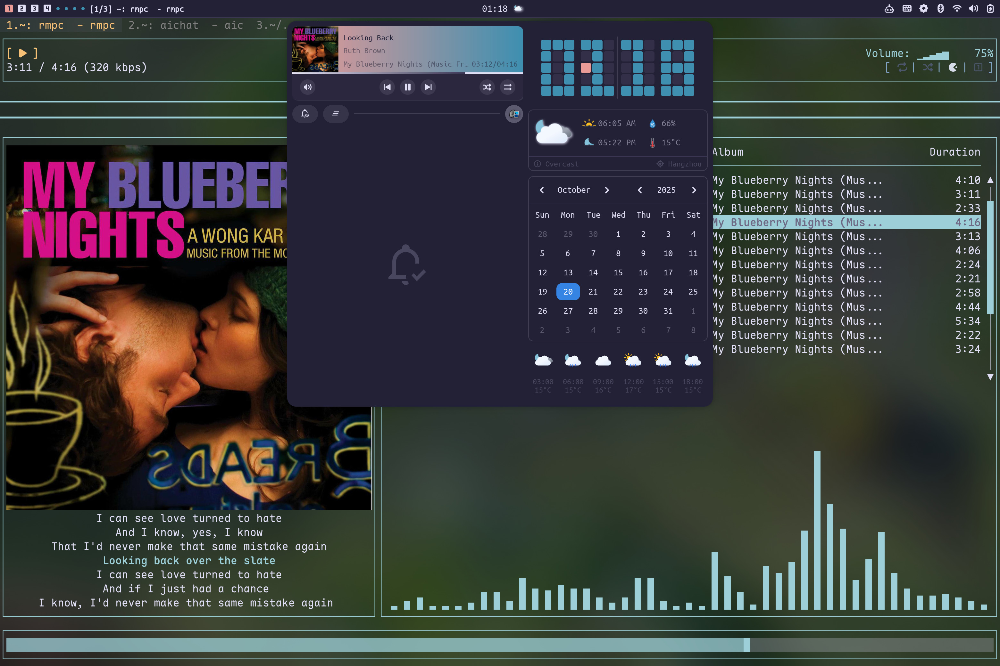

# My Dotfiles
> this is a dotfile repo

# Components


- **WM**        : [Hyprland](https://github.com/hyprwm/Hyprland) :art: WM for Wayland!
- **Colors**    : [Rosé Pine](https://rosepinetheme.com/) :rainbow: Something beautiful!
- **Shell**     : [fish](https://fishshell.com/) :shell: Finally, a command line shell for the 90s
- **Terminal**  : [wezterm](https://wezterm.org/) :heavy_dollar_sign: a powerful terminal emulator and multiplexer
- **Desktop**   : [AGS](https://github.com/Aylur/ags) :rocket: A framework for crafting Wayland Desktop Shells
- **Wallpaper** : [wbg](https://codeberg.org/dnkl/wbg) :framed_picture: Super simple wallpaper application

and some other stuff.

# How to use
```
# eg: setup ags config
> ln -s `pwd`/ags $XDG_CONFIG_HOME/ags
```

# Download some fonts
> AUR ([Nerd Fonts Group](https://archlinux.org/groups/any/nerd-fonts/))

Fonts used: Ubuntu*, JetBrains*, Twitter Color Emoji
