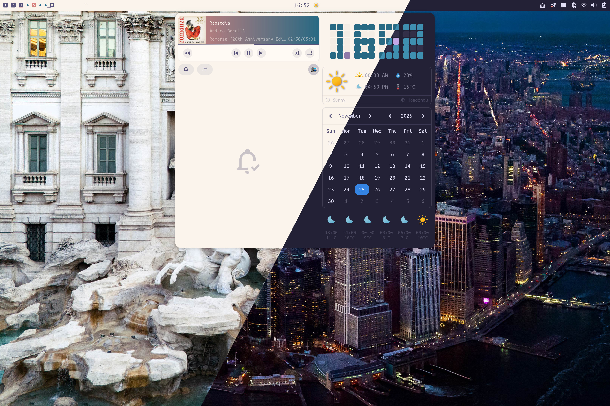

# My Dotfiles
> Aesthetic Hyprland + AGS setup with Rosé Pine 🌸

A personalized dotfiles collection featuring a Wayland workflow built around [Hyprland](https://github.com/hyprwm/Hyprland) and [AGS](https://github.com/Aylur/ags), themed with the beautiful [Rosé Pine](https://rosepinetheme.com/) color palette.

# Preview

<details>
<summary>Click to show/hide screenshot 📸</summary>

<div align="center">
  
</div>

</details>

# Components

- 🎨 **WM**        : [Hyprland](https://github.com/hyprwm/Hyprland) - A highly customizable, dynamic tiling Wayland compositor with eye-candy effects
- 🌸 **Colors**    : [Rosé Pine](https://rosepinetheme.com/) - A beautiful, ergonomic color palette with a retro aesthetic
- 🐟 **Shell**     : [fish](https://fishshell.com/) - A smart, user-friendly command line shell with syntax highlighting
- 💻 **Terminal**  : [wezterm](https://wezterm.org/) - A GPU-accelerated terminal emulator with ligatures and tabs
- 🚀 **Desktop**   : [AGS](https://github.com/Aylur/ags) - A powerful framework for building stylish Wayland desktop widgets
- 🖼️ **Wallpaper** : [wbg](https://codeberg.org/dnkl/wbg) - Minimalist wallpaper utility that stays out of your way

# Prerequisites

```bash
paru -S hyprland fish

# AGS (from AUR or build from source)
paru -S wezterm-git aylurs-gtk-shell-git
```

# Installation

```bash
# Clone the repository
git clone https://github.com/id0o0bi/dots ~/.dotfiles
cd ~/.dotfiles

# Symlink configurations
ln -s $(pwd)/ags ~/.config/ags
ln -s $(pwd)/wezterm ~/.config/wezterm
ln -s $(pwd)/hypr ~/.config/hypr
# Add more as needed...
```

# Fonts

Install these fonts (AUR: [Nerd Fonts Group](https://archlinux.org/groups/any/nerd-fonts/)):

- Ubuntu Nerd Font
- JetBrains Mono Nerd Font
- Twitter Color Emoji

```bash
yay -S ttf-ubuntu-nerd ttf-jetbrains-mono-nerd ttf-twemoji-color
```

# License

MIT - Feel free to use anything here! 🎉

# Credits

- [Rosé Pine](https://rosepinetheme.com/) for the amazing color palette
- [Hyprland](https://github.com/hyprwm/Hyprland) team for the fantastic WM
- [Aylur/AGS](https://github.com/Aylur/ags) for the desktop shell framework
